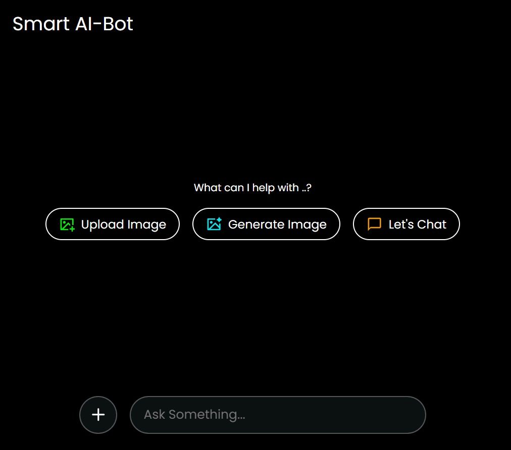

# React + Vite

This template provides a minimal setup to get React working in Vite with HMR and some ESLint rules.

Currently, two official plugins are available:

- [@vitejs/plugin-react](https://github.com/vitejs/vite-plugin-react/blob/main/packages/plugin-react/README.md) uses [Babel](https://babeljs.io/) for Fast Refresh
- [@vitejs/plugin-react-swc](https://github.com/vitejs/vite-plugin-react-swc) uses [SWC](https://swc.rs/) for Fast Refresh

🤖 Smart AI-Bot :- 
- Live Demo: https://smartai-botbyashraf.netlify.app/  

📋 Description :- 
Smart AI-Bot is an interactive web application that enables users to:

- Chat with AI for real-time responses.
- Upload images and ask AI-related questions about the image.
- Generate images from text prompts using advanced AI models.

This project uses powerful AI technologies for both text-based interactions and image generation, creating an engaging and dynamic user experience.

🚀 Features :- 

- 💬 Real-time AI Chat: Engage in conversations and get intelligent responses.
- 📤 Image Upload: Upload images and ask related questions.
- 🎨 AI-Generated Images: Convert text prompts into images using AI models.
- ⚡ Responsive UI: A user-friendly and mobile-friendly design for seamless interaction.

🛠️ Tech Stack :- 

1. Frontend:

- React – Building reusable UI components.
- Vite – Fast development environment.
- HTML5 & CSS3 – Markup and styling.

2. APIs & Libraries:

- Gemini API – For AI-powered text generation.
- Hugging Face API – For text-to-image generation.

3. Custom API Integration:

- gemini.js: Handles AI-generated text responses.
- huggingface.js: Manages image generation based on user prompts.

4. Build Tools:

- ESLint – Ensures code consistency and quality.

# Important Note

🔧 Installation & Setup

To run this project locally:

1. Clone the repository:
- git clone https://github.com/Ashrafkhan1224/Smart-AI-Bot.git
- cd Smart-AI-Bot

2. Install dependencies:
- Make sure you have Node.js installed. Then run : npm install

3. API Configuration:

- In gemini.js, replace "Your Api" with your actual Gemini API key

- const Api_Url = "https://generativelanguage.googleapis.com/v1beta/models/gemini-1.5-flash:generateContent?key=YOUR_API_KEY"

- In huggingface.js, replace "Your Api" with your Hugging Face API key

- Authorization: "Bearer YOUR_API_KEY"

4. Run the application: npm run dev

5. Visit: Open http://localhost:3000 in your browser to test the app locally.

📸 Screenshots

- Here is a preview of the Smart AI-Bot interface:

🎉 Enjoy!
Hope you have a great time exploring Smart Ai-Bot! 🚀